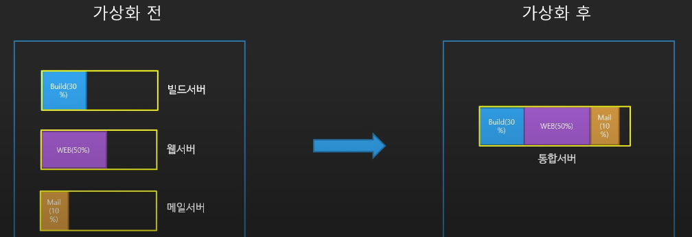

# 가상화
* 단일 컴퓨터의 하드웨어 요소를 일반적으로 가상 머신(VM)이라고 하는 다수의 가상 컴퓨터로 분할할 수 있도록 해주는 기술

## 가상화의 역사
### 1세대
### 2세대
### 3세대 : Hardware Virtual Machine(HVM)
* 하드웨어에서 직접 가상화를 지원
* 직접 Guest-OS가 하드웨어와 통신 = 빠른 속도(near bare-metal)

### Reference
-  https://www.youtube.com/playlist?list=PLfth0bK2MgIan-SzGpHIbfnCnjj583K2m