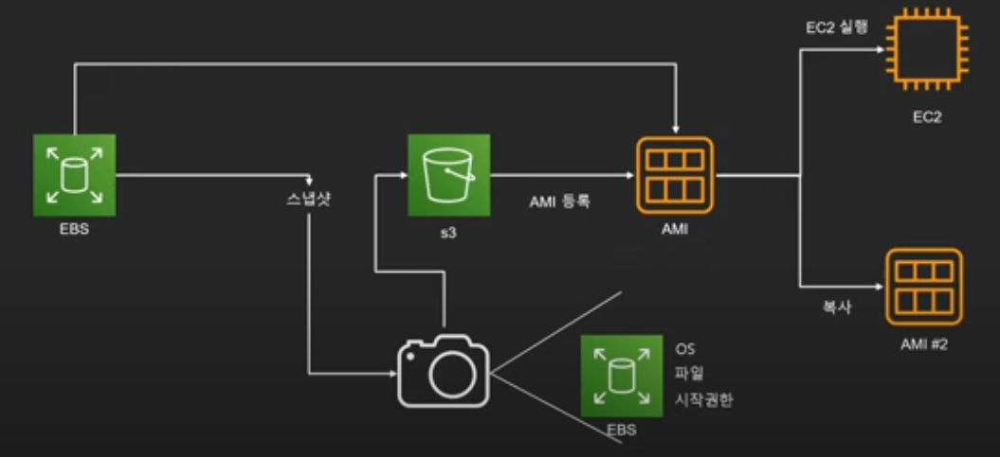

# EC2
* Elastic Compute Cloud
* 안전하고 크기 조정이 가능한 컴퓨팅 파워를 클라우드에서 제공하는 웹 서비스
    * 클라우드 = 빌려쓰기
    * => EC2 = 컴퓨팅을 빌려쓰는 서비스


# EC2의 가격 모델
## 저렴한 가격 순
### Spot Instance
* 경매 형식으로 시장에 남는 인스턴스를 저렴하게 구매해서 쓰는 방식
* 최대 90% 정도 저렴
* 단 언제 도로 내주어야 할지 모름
시작 종료가 자유롭거나 추가적인 컴퓨팅 파워가 필요한 경우

### 예약 인스턴스(Reserved Instance-RI)
* 미리 일정 기간(1년 - 3년) 약정해서 쓰는 방식
* 최대 75%정도 저렴
* 수요 에측이 확실할 때
* 총 비용을 절감하기 위해 어느정도 기간의 약정이 가능한 사용자

### On-Demand
* 실행하는 인스턴스에 따라 시간 또는 초당 컴퓨팅 파워로 측정된 가격을 지불
* 약정은 필요 없음
* 장기적인 수요 예측이 힘들거나 유연하게 EC2를 사용학 싶을 때
* 한 번 써보고 싶을 때

### 전용 호스트(Dedicated)
* 실제 물리적인 서버를 암대하는 방식
* 라이선스 이슈(Windows Server 등)
* 규정에 따라 필요한 경우
* 퍼포먼스 이슈 (CPU Steal 등)

## * EC2의 가격모델은 EBS와는 별도 (EBS는 사용한 만큼 지불)
## * 기타 데이터 통신 등의 비용은 별도로 청구 (AWS 바깥으로 나가는 트래픽에 대해서만 요금 부과)


# EC2의 유형과 크기
* 인스턴스 유형 = 일종의 직업
* 인스턴스 사이즈 = 일종의 레벨
* 타입별로 이름 부여 ex) t타입, m타입, inf타입 등
* 타입 세대별로 숫자 부여 ex) m5 = m인스턴스의 5번째 세대
* 아키텍쳐 및 사용 기술에 따라 접두사 ex) t4g = t4 인스턴스 중 AWS Graviton 프로세서를 사용(g)
* t2 micro : 프리 티어 사용 가능


# EC2 - EBS, Snapshot, AMI
## EBS
* Elastic Block Store : AWS 클라우드의 EC2 인스턴스에 사용할 **영구 블록 스토리지** 볼륨을 제공
* 가상 하드드라이브
* EC2 인스턴스가 종료되어도 계속 유지 가능 (서로 분리되어 **네트워크**로 연결되어 있음)
* 하나의 EBS를 여러 EC2 장착 가능( EBS Multi Attach)
* 루트 볼륨으로 사용시 EC2가 종료되면 같이 삭제됨
    * 단 설정을 통해 EBS만 따로 존속 가능
* EC2와 **같은 가용영역**에 존재
* 총 5가지 타입을 제공
    * 범용 (General Purpose or GP3) : SSD
        * 1GB ~ 16GB
    * 프로비저닝 된 IOPS (Provisioned IOPS or io2) : SSD
        * 4GB ~ 16GB
    * 쓰루풋 최적화 (Throughput Optimized HDD or st1)
        * 500GB ~ 16TB
    * 콜드 HDD (SC1)
        * 500GB ~ 16TB
    * 마그네틱 (Standard)
        * 1GB ~ 1TB


## Snapshot
* 특정 시간에 EBS 상태의 저장본 : EBS에 사진을 찍어둔 개념
* 필요시 스냅샷을 통해 특정 시간의 EBS를 복구 가능
* S3(파일 저장소)에 보관
    * EBS보다 가격이 저렴하다.
    * 증분식 저장 : 현재 저장 순간과 이 전에 저장해둔 차이점(변화한 것만) 저장하는 방식 -> 히스토리 저장하는 식

## AMI
* Amazon Machine Image
* <u>EC2 인스턴스를 실행하기 위해 필요한 **정보**를 모은 단위</u>
    * OS, 아키텍쳐 타입, 저장공간 용량 등
* AMI를 사용하여 EC2를 복제하거나 다른 리전이나 계정으로 전달 가능
* 스냅샷을 기반으로 AMI 구성 가능
* 구성 요소
    1. 1개 이상의 EBS 스냅샷
    2. 인스턴스 저장 인스턴스의 경우 루트 볼륨에 대한 템플릿(예: 운영 체제, 애플리케이션 서버, 애플리케이션)
    3. 사용 권한(어떤 AWS 어카운트가 사용할 수 있는지)
    4. 블록 디바이스 맵핑(EC2 인스턴스를 위한 볼륨 정보 = EBS가 무슨 용량으로 몇 개 붙는지)
* 타입
    1. EBS 기반
        - 일반적인 경우로, EC2와 EBS가 네트워크로 연결되어 있음
        - 생성방법 : 스냅샷을 기반으로 루트 디바이스 생성
    2. 인스턴스 저장(storage) 기반
        - 속도를 위해 EC2 안에 속하는 것
        - 인스턴스를 삭제하면 자동으로 같이 사라짐
        - 생성방법 : S3에 저장된 템플릿을 기반으로 생성
* AMI 생성 과정

    1. EBS의 스냅샷을 찍는다. (OS, 파일, 시작 권한 등의 정보가 담겨있음)
    2. 스냅샷을 S3에 저장한다.
    3. 스냅샷을 기반으로 AMI를 등록(생성)한다.
    4. 생성된 AMI를 가지고 EC2를 실행하거나, 복사해서 다른사람과 공유하는 등 필요에 따라서 적절히 사용한다.

## EC2 인스턴스 만들기
### 1. 이름 및 태그 추가
### 2. AMI 선택
[Amazon Linux 2023 AMI와 Amazon Linux 2 AMI-Kernel 5.10, SSD Volume Type의 차이](./etc/ami-type.md/#amazon-linux-2023-ami와-amazon-linux-2-ami-kernel-510-ssd-volume-type의-차이)
### 3. 인스턴스 유형 선택
* t2.micro : 프리티어
### 4. 키 페어 입력 (최초에는 새로 만들어야 함)
* 기존에 있는 거 선택하거나 새로 생성하거나~
### 5. 보안 그룹 생성
* 일단 HTTP 추가 or 기존에 있는 거 선택하거나
### 6. 스토리지 추가 
* 마그네틱(standard)이 제일 저렴함
* 종료 시 삭제 : 인스턴스 삭제 시 자동으로 EBS 삭제 여부
### 7. 인스턴스 시작

## 연결 후 웹서버 실행
* 실습에는 임시적 연결이므로 EC2 Instance Connect을 사용하여 연결
* 명령어
```
sudo -s  # 루트 사용자로 전환

yum install httpd -y  # Apache 웹 서버 설치

service httpd start  # Apache 웹 서버 시작

nano /var/www/html/index.html  # 해당 경로에 index.html 파일을 생성 및 편집 (메인 페이지)

service httpd status  # Apache 웹 서버 상태 확인
```
[연결 실패 문제 해결](./etc/security-group.md/#보안-그룹-defaul-선택-후-발생하는-문제들)

## EC2 인스턴스 AMI 이용해서 복제하기
### 1. 복사 대상 EC2 인스턴스 우클릭 > 이미지 및 템플릿 > 이미지 생성
### 2. 이미지 생성
1. 이름, 설명 작성
2. 인스턴스 재부팅 여부 선택
3. 크기 말고 다른 설정사항은 변경 불가
4. '이미지 생성' 클릭
#### 이미지 생성하는데 약간의 시간이 소요 됨...
### 3. 상태가 '사용 가능'으로 변경될 때까지 대기
### 4. '인스턴스 시작' 클릭
### 5. 이름 및 태그 작성
### 6. '내 AMI' 선택
* 내가 위에서 생성한 이미지 EC2를 찾을 수 있다.
### 6-1. 위에서 생성한 AMI 선택
### 7. 인스턴스 유형 선택
### 8. 키페어 선택
* 일단 실습에선 '키 페어 없이 계속 진행' 선택
### 9. 방화벽(보안 그룹) 선택
* 실습에선 '기존 보안 그룹 선택' > default 선택
### 10. 스토리지 구성
* 기존 스토리지와 동일하게 되어 있음
### 11. '인스턴스 시작' 클릭
* Apache 웹 서버를 설치한 것까지는 다 되어 있고, 서버 시작만 해 주면 된다.
### 12. 인스턴스 연결 후 서버 시작만 시키고 접속해서 확인
```
sudo -s
service httpd start
```

**<span style="color:red">안 쓰는 인스턴스 종료는 필수!!!</span>**


### Reference
-  https://www.youtube.com/playlist?list=PLfth0bK2MgIan-SzGpHIbfnCnjj583K2m