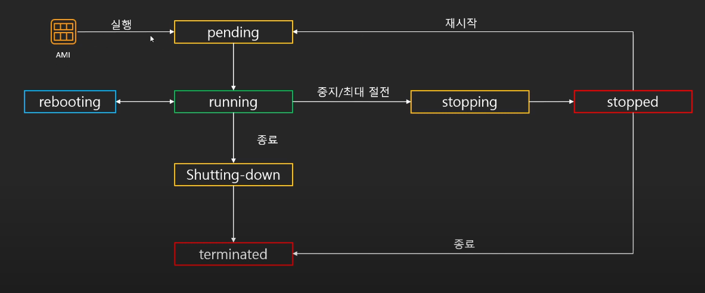

# EC2 생명주기
* AMI로 부터 실행이 된 후 종료될 때까지 EC2가 거치는 과정

### pending
* 인스턴스가 running 상태로 될 준비 상태
* 요금 미청구
### running
* 인스턴스 사용 중인 상태
* 요금 청구
* 우리가 할 수 있는 행동
1. 중지 : 인스턴스를 잠시 멈추는 것
    * 중지 중에는 인스턴스 요금 미 청구
    * 단 EBS 요금, 다른 구성요소는 청구
    * 중지 후 재시작시 퍼블릭 IP가 변경 됨 (동적 IP이므로 탄력적 IP를 이용해 쉽게 사용 가능)
    * EBS를 사용하는 인스턴스만 중지 가능 (인스턴스 저장 인스턴스는 중지 불가능)
2. 재부팅 : 인스턴스 다시 시작하는 것
    * 재부팅시에는 퍼블릭 IP 변동 없음
3. 최대 절전모드
    * 메모리 내용을 하드디스크에 보존해서 재시작시 중단 지점에서 재시작하는 정지 모드
### stopping
* 인스턴스가 중지 또는 최대 절전 모드로 전환 중
* 요금 미청구(최대 절전시 청구)
### stopped
* 인스턴스가 중지된 상태 : 재시작 가능
* 요금 미청구
### shutting-down
* 인스턴스가 종료 중인 상태
* 요금 미청구
### terminated
* 인스턴스가 영구적으로 삭제된 상태
* 당연히 요금 미청구

### Reference
-  https://www.youtube.com/playlist?list=PLfth0bK2MgIan-SzGpHIbfnCnjj583K2m