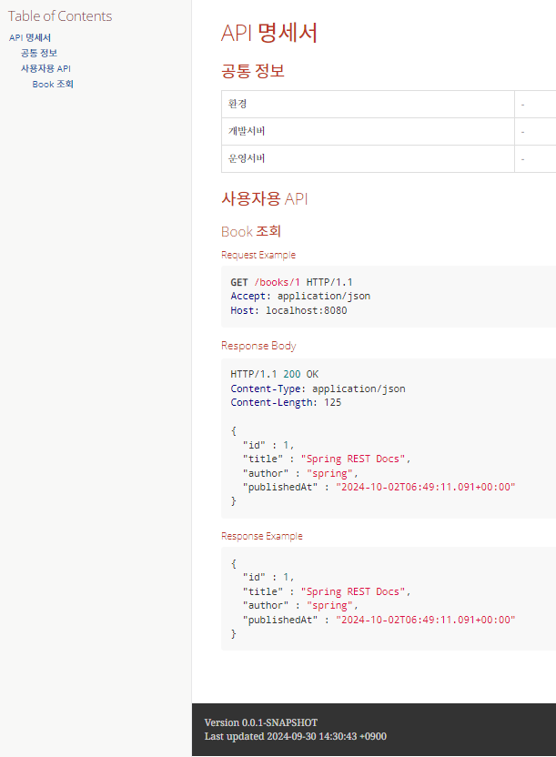
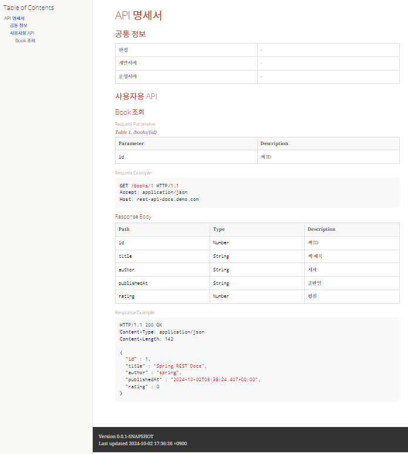
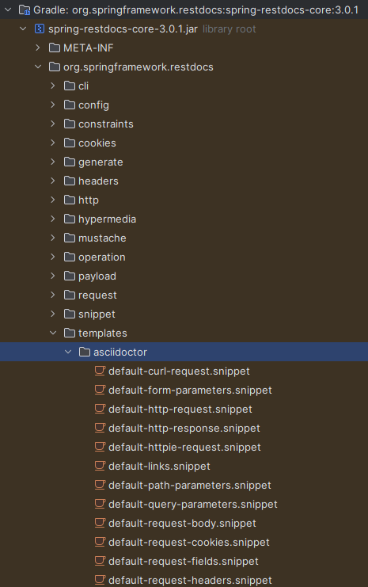
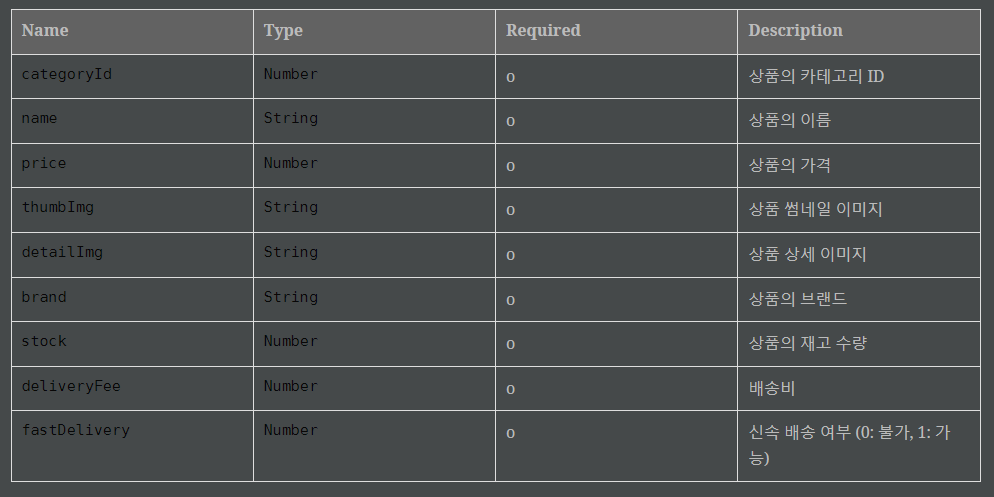
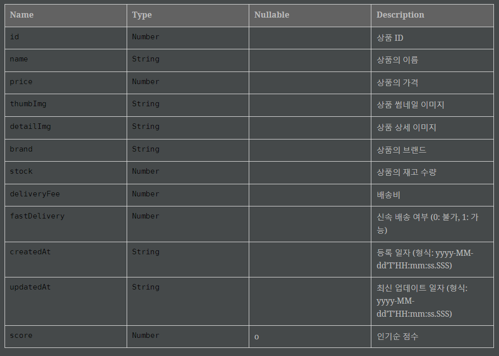
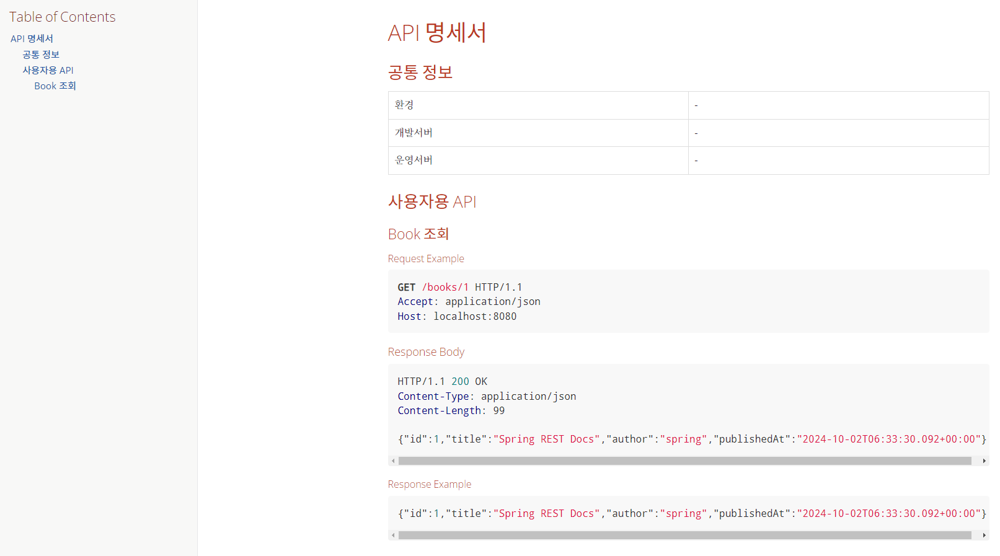
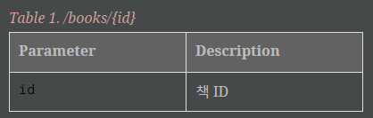

# Spring REST Docs
## Spring REST Docs vs Swagger
* ### Swagger
    #### 장점
    * Annotation 기반으로 문서 생성
    * 쉽다
    * GUI로 API 테스트 가능
    #### 단점
    * Production 코드에 문서화를 위한 코드가 추가됨
    * 검증되지 않은 문서 생성
* ### Spring REST Docs
    * 테스트 코드 기반으로 RESTful 문서생성을 돕는 도구
    * [Asciidoctor](#1-asciidoctor)를 사용하여 HTML를 생성
    * 테스트로 생성된 [snippet](#2-snippet)을 사용해서 정확성을 보장함
    #### 장점
    * 테스트가 성공해야 문서가 생성(실패 시 안만들어짐) -> 검증된 문서
    * Production 코드에 영향 없음
    * api 명세 최신화가 강제
    #### 단점
    * 어렵다
    * 테스트 코드 양이 많아짐

## Spring REST Docs 적용하기 (with Gradle and Junit5)
### 1. 의존성
* Spring Web, Spring REST Docs
```gradle
dependencies {
	implementation 'org.springframework.boot:spring-boot-starter-web'
	testImplementation 'org.springframework.boot:spring-boot-starter-test'
	testImplementation 'org.springframework.restdocs:spring-restdocs-mockmvc'
	testRuntimeOnly 'org.junit.platform:junit-platform-launcher'
}

ext {
	set('snippetsDir', file("build/generated-snippets"))
}

tasks.named('test') {
	outputs.dir snippetsDir
	useJUnitPlatform()
}

tasks.named('asciidoctor') {
	inputs.dir snippetsDir
	dependsOn test
}
```
### 2. 테스트 코드 작성

```Java
package com.example.rest_docs.books;

import static org.springframework.restdocs.mockmvc.MockMvcRestDocumentation.document;
import static org.springframework.restdocs.mockmvc.MockMvcRestDocumentation.documentationConfiguration;
import static org.springframework.test.web.servlet.request.MockMvcRequestBuilders.get;
import static org.springframework.test.web.servlet.result.MockMvcResultMatchers.status;

import org.junit.jupiter.api.BeforeEach;
import org.junit.jupiter.api.Test;
import org.junit.jupiter.api.extension.ExtendWith;
import org.springframework.boot.test.autoconfigure.web.servlet.WebMvcTest;
import org.springframework.http.MediaType;
import org.springframework.restdocs.RestDocumentationContextProvider;
import org.springframework.restdocs.RestDocumentationExtension;
import org.springframework.test.web.servlet.MockMvc;
import org.springframework.test.web.servlet.setup.MockMvcBuilders;
import org.springframework.web.context.WebApplicationContext;

@ExtendWith(RestDocumentationExtension.class) // 1
@WebMvcTest(BookController.class) //2
class BookControllerTest {

  private MockMvc mockMvc;

  // 3
  @BeforeEach
  void setUp(WebApplicationContext webApplicationContext, RestDocumentationContextProvider restDocumentation) {
    this.mockMvc = MockMvcBuilders.webAppContextSetup(webApplicationContext)
        .apply(documentationConfiguration(restDocumentation)) // 4
        .build();
  }

  @Test
  void getBook() throws Exception {
    // 5
    mockMvc.perform(get("/books/{id}", 1L).accept(MediaType.APPLICATION_JSON)) // 6
        .andExpect(status().isOk()) // 7
        .andDo(document("get-a-book")); // 8
  }
}
```
1. 문서 snippet을 생성하는 첫 번째 단계는 `RestDocumentationExtension`을 테스트 클래스에 적용한다.
    * `RESTDocumentationExtension`은 프로젝트의 빌드 도구를 기반으로 출력 디렉토리로 자동 구성됨
        * `build/build/generated-snippets` (Maven은 경로 다름 주의)
        ```gradle
        // build.gradle
        
        ...
        
        ext {
            set('snippetsDir', file("build/generated-snippets"))
        }

        ...
        
        ```
2. `WebApplicationContext`를 테스트 컨텍스트에서 주입하기 위해 테스트 클래스에 Spring 컨텍스트를 로드해야 하는데, 이를 위해 `@SpringBootTest` 또는 `@WebMvcTest` 어노테이션을 사용해야 한다.
여기서는 `MockMvc` 테스트를 진행 중이므로 `@WebMvcTest`를 사용한다. 이 어노테이션은 웹 계층(Controller)만 로드하고, 전체 애플리케이션 컨텍스트는 로드하지 않기 때문에 더 가볍다.(<u>단위 테스트: 보통 Spring REST Docs는 통합 테스트에 적용하지만, 지금은 실습이니 가볍게 단위테스트에 적용한다.</u>)
3. 다음으로 `MockMVC`를 구성하는 `@Beforeeach` 메소드를 만든다.
4. `Mockmvc` 인스턴스는 `MockmvcrestDocumentationConfigurer`를 사용하여 구성되는데, 이는 `org.springframework.restdocs.mockmvc.mockmvcrestdocumentation`의 정적 `documentationConfiguration ()` 메소드에서 생성한다.
5. 테스트 프레임 워크를 구성 했으므로 이를 사용하여 나머지 서비스를 호출하고 요청 및 응답을 문서화 할 수 있다.
6. 서비스의 `/books/1`를 호출하고, `application/JSON` 응답이 필요하다는 것을 나타낸다.
7. 서비스가 예상 응답을 생성했다고 주장한다.
8.  **snippet을 `get-a-book` (구성된 출력 디렉토리 아래에 위치)라는 디렉토리로 작성하여 서비스에 대한 호출을 문서화해준다.**
    * snippet은 `RestDocumentationResulthandler`가 작성하는데, `org.springframework.restdocs.mockmvc.mockmvcrestdocumentation`의 정적 `document ()` 메소드에서 생성한다.
    * 기본적으로 6개의 snippet이 작성된다.
        * `<output-directory>/get-a-book/curl-request.adoc`
        * `<output-directory>/get-a-book/http-request.adoc`
        * `<output-directory>/get-a-book/http-response.adoc`
        * `<output-directory>/get-a-book/httpie-request.adoc`
        * `<output-directory>/get-a-book/request-body.adoc`
        * `<output-directory>/get-a-book/response-body.adoc`
### 3. 테스트 실행
* 테스트가 성공하면, `build/generated-snippets/get-a-book/`이 경로에 snippet 자동 생성! 
* 여기까지만 해도 Spring REST Docs로 API 문서 자동화 끝!!!!
* But, 이대로 두기엔 가독성이 너무 떨어지므로 좀 더 보기 좋게 예쁘게 개선해보자.
### 4. 그 전에 Gradle 추가 설정하기
* 프로젝트를 build할 때 자동으로 테스트가 되고, 또 테스트를 여러번 하면 기존 snippet은 삭제하고 새로운 snippet이 잘 생성되도록 설정하기
```gradle
ext {
    set('snippetsDir', file("build/generated-snippets"))
    set('docsOutputDir', file("build/docs/asciidoc"))	// API 문서가 생성되는 경로
    set('projectDocsDir', file("src/main/resources/static/docs"))	// 생성된 API 문서를 복사할 경로
}
 
tasks.named('bootJar') {
    dependsOn 'asciidoctor'	// asciidoctor 수행 후 bootJar 수행
}
 
tasks.named('test') {
    doFirst { delete(snippetsDir) }	// test 수행 전 실행
    outputs.dir snippetsDir
}
 
tasks.named('asciidoctor') {
    doFirst {	// asciidoctor 수행 전 실행
        delete(docsOutputDir)	// 기존 생성된 API 문서 삭제
        delete(projectDocsDir)	// 기존에 복사된 API 문서 삭제
    }
    inputs.dir snippetsDir
    dependsOn test
    doLast {	// asciidoctor 수행 완료 후 실행
        copy {	// 생성된 API 문서를 지정된 경로에 복사
            from docsOutputDir
            into projectDocsDir
        }
    }
}
```
* 마지막 `asciidoctor`작업의 `doLast`에 추가한 내용은 API 문서가 생성된 이후에 서버에 접속하여 바로 확인할 수 있도록 build 디렉토리 내에 생성된 API 문서를 프로젝트의 resources/static으로 복사하는 것이다.
### 5. API 문서를 예쁘게 만들기
#### 1. `.adoc`파일 만들기
* `.adoc`파일을 만들어야 한다. 경로는 아래와 같다.
    * `src/docs/asciidoc/*.adoc`(파일명은 원하는대로, 일반적으로 index)
    * Maven은 경로 다름 주의
* 생성한 파일에 스니펫 포함하기
```
// 공식 문서에 나온 예시 코드
include::{snippets}/get-a-book/curl-request.adoc[]
```
#### 2. `.html`파일 만들기
* 방법1: IntelliJ우측 Gradle > documentation > asciidoctor
* 방법2: 터미널에 `./gradlew asciidoctor` 입력
* `build/asciidoc/*.html` 이 경로에 `.html`파일이 만들어 진다.
    * [안될 시 해결 방법](#-asciidoctor를-통해-indexadoc-파일을-읽어서-indexhtml-파일을-생성하는-작업에서-indexadoc-파일-내-including한-경로를-찾지-못해-발생하는-문제)
    * Maven은 경로 다름 주의
#### 3. JSON 예쁘게 만들기
* 우리가 기대한 결과
```
{
    "id":1,
    "title":"Spring REST Docs",
    "author":"spring",
    "publishedAt":"2024-09-27T08:43:41.898+00:00"
}
```
* 실제 출력되는 모습
```
{"id":1,"title":"Spring REST Docs","author":"spring","publishedAt":"2024-09-27T08:43:41.898+00:00"}
```
1. 우리가 기대한 결과로 바꿔주기
    ```java
    @Test
    void getBook() throws Exception {
        
        mockMvc.perform(get("/books/{id}", 1L).accept(MediaType.APPLICATION_JSON)) // 5
            .andExpect(status().isOk()) // 6
            .andDo(document("get-a-book",
                // 여기 수정
                preprocessRequest(prettyPrint()),
                preprocessResponse(prettyPrint()))
            );
    }
    ```
    * 위와 같이 코드 추가 후 다시 테스트 돌려보면 요청, 응답 스니펫이 예쁘게 나온 걸 확인할 수 있다.
2. 중복 코드 리팩토링하기
    ```java
    @BeforeEach
    void setUp(WebApplicationContext webApplicationContext, RestDocumentationContextProvider restDocumentation) {
        this.mockMvc = MockMvcBuilders.webAppContextSetup(webApplicationContext)
            .apply(documentationConfiguration(restDocumentation))
            .alwaysDo(document("get-a-book",
                preprocessRequest(prettyPrint()),
                preprocessResponse(prettyPrint())))
            .build();
    }
    ```
    * `MockMvc` 생성시 `alwagsDo()`를 사용하여 한번에 기본 설정을 할 수 있다.

#### 4. HTML 예쁘게 만들기
* [여기서 만든](#1-adoc파일-만들기) .adoc 파일을 아래 두 가지를 사용하여 개선
    * Asciidoc 문법
    * AsciiDoc 플러그인
* 방법은 [여기](#해결) (문제 해결하면서 우연히 발견)
* 여기까지 결과 화면

### 5. REST하게 정보를 더 추가해서 완벽한 API 문서 완성하기
```java
@Test
  void getBook() throws Exception {

    mockMvc.perform(get("/books/{id}", 1L).accept(MediaType.APPLICATION_JSON))
        .andExpect(status().isOk())
        .andExpect(jsonPath("$.id").value("1"))
        .andExpect(jsonPath("$.title").value("Spring REST Docs"))
        .andExpect(jsonPath("$.author").value("spring"))

        .andDo(document("/get-a-book",
            preprocessRequest(
                prettyPrint(),
                modifyUris()
                    .scheme("https")
                    .host("rest-api-docs.demo.com")
                    .removePort() // 1
            ),
            preprocessResponse(prettyPrint()),
            pathParameters( // 2
                parameterWithName("id").description("책 ID")
            ),
            responseFields( // 3
                fieldWithPath("id").description("책 ID"),
                fieldWithPath("title").description("책 제목"),
                fieldWithPath("author").description("저자"),
                fieldWithPath("publishedAt").description("출판일"),
                fieldWithPath("rating").description("평점").type(JsonFieldType.NUMBER).optional()
            )
        ));
}
```
1. API의 호스트 변경.
    * modifyUris()를 설정하지 않으면 요청 문서의 호스트가 기본값인 localhost:8080으로 작성됨 (스키마와 호스트, 포트 정보의 경우 테스트 클래스의 `@AutoConfigureRestDocs`에서 공통으로 처리할 수도 있음)
2. `@PathVariable`에 들어가는 값을 문서화 하는 것
    * 여기엔 없지만 `requestParameters`는 `@RequestParam`에 들어가는 값을 문서화한다.
3. 응답 body 필드를 문서화 하는 것
* 매번 테스트 코드 작성할 때마다 중복되어 작성하는 코드부분은 따로 유틸 클래스로 만들어서 커스텀 할 수 있다.

### 6. 최종 결과물



### 7. snippet 커스텀 하기
* 요청 필드의 필수값 여부, 응답 필드의 Null 여부 표시하기
1. 프로젝트 탐색기에서 External Libraries > `spring-restdocs-core` 펼치기
2. templates > asciidoctor 을 펼치면, 테스트할 때 생성되는 스니펫의 포멧이 되는 .snippet 파일들이 존재

3. `src/test/resource/org/springframework/restdocs/templates`에 `request-fields.snippet` 생성 후 2번에서 찾은 `default-request-fields.snippet`복붙
4. 다움과 같이 수정.
    * ※ 들여쓰기 절대 금지
```
|===
|Name|Type|Required|Description

{{#fields}}
|{{#tableCellContent}}`+{{path}}+`{{/tableCellContent}}
|{{#tableCellContent}}`+{{type}}+`{{/tableCellContent}}
|{{#tableCellContent}}{{^optional}}o{{/optional}}{{/tableCellContent}}
|{{#tableCellContent}}{{description}}{{/tableCellContent}}

{{/fields}}
|===
```
5. 마찬가지로 3번과 같은 경로에 `response-fields.snippet` 생성 후 `default-response-fields.snippet` 복붙 후 다음과 같이 수정
    * ※ 들여쓰기 절대 금지
```
|===
|Name|Type|Nullable|Description

{{#fields}}
|{{#tableCellContent}}`+{{path}}+`{{/tableCellContent}}
|{{#tableCellContent}}`+{{type}}+`{{/tableCellContent}}
|{{#tableCellContent}}{{#optional}}o{{/optional}}{{/tableCellContent}}
|{{#tableCellContent}}{{description}}{{/tableCellContent}}

{{/fields}}
|===
```
6. 테스트 실행 후 snippet 결과 확인 ([e-commerce mall 프로젝트](https://github.com/f-lab-edu/e-commerce-mall))
* request-fields.adoc

* response-field.adoc



---
##### [1] Asciidoctor
* AsciiDoc을 HTML, DocBook 등으로 변환하기 위한 빠른 텍스트 프로세서(.adoc)
##### [2] snippet
* 문서화에 필요한 문서 조각

## 문제 해결
### ⚠ asciidoctor를 통해 index.adoc 파일을 읽어서 index.html 파일을 생성하는 작업에서 index.adoc 파일 내 including한 경로를 찾지 못해 발생하는 문제
> #### 발단
* index.adoc 파일을 만들고 index.html로 문서를 확인하고 싶어서 asciidoctor을 실행시켰다.
> #### 문제
* snippet 내용이 나올 줄 알았는데 index.html에 아래와 같은 내용이 나왔다.
```
<p>Unresolved directive in index.adoc - include::{snippets}/get-a-book/curl-request.adoc[]
Unresolved directive in index.adoc - include::{snippets}/get-a-book/http-request.adoc[]
Unresolved directive in index.adoc - include::{snippets}/get-a-book/http-response.adoc[]
Unresolved directive in index.adoc - include::{snippets}/get-a-book/httpie-request.adoc[]
Unresolved directive in index.adoc - include::{snippets}/get-a-book/request-body.adoc[]
Unresolved directive in index.adoc - include::{snippets}/get-a-book/response-body.adoc[]</p>
```
경로를 찾을 수 없다는 것!
> #### 해결
* 경로에 있는 {snippets} 값을 지정해주지 않아서 발생한 문제였다.
* `:snippets: build/generated-snippets` 이렇게 snippets에 경로 저장
* adoc 문법 모르는 주니어 개발자의 역경...
* 덕분에 해결방법 찾으면서 추가로 좋은 설정 몇 개 알아냄
    * `:snippets: build/generated-snippets` : snippets라는 속성을 build/generated-snippets로 정의
    * `:doctype: book` : API 문서의 형식을 지정
        * article, book, manpage, inline을 지원
        * 기본값은 article
    * `:source-highlighter: highlightjs` : 소스코드 강조하는 라이브러리 지정
    * `:toc: left` : 목차 위치 지정
        * auto(문서 최상단), left, right
    * `:toclevels: 3` : 목차에 표시할 제목의 단계 지정 (3단계 제목까지 표시하는 코드)
    * `:sectlinks:` : 각 세션 제목을 하이퍼링크로 설정
* index.adoc 코드
```adoc
:snippets: build/generated-snippets
:doctype: book
:source-highlighter: highlightjs
:toc: left
:toclevels: 3
:sectlinks:

[[common]]
== API 명세서
=== 공통 정보
|===
| 환경 | -
| 개발서버 | -
| 운영서버 | -
|===

[[user]]
=== 사용자용 API
[[book]]
==== Book 조회
====== Request Example
include::{snippets}/get-a-book/http-request.adoc[]
===== Response Body
include::{snippets}/get-a-book/http-response.adoc[]
====== Response Example
include::{snippets}/get-a-book/response-body.adoc[]
&nbsp;
```
* index.html 결과 화면


### ⚠ URL 템플릿을 사용하였음에도, urlTemplate not found. If you are using MockMvc did you use RestDocumentationRequestBuilders to build the request? 발생
> #### 발단
API 문서에 다양한 정보를 추가하고 있는 중에 요청 파라미터 정보도 추가하기 위해 
다음과 같은 코드를 추가 하였다.
```java
pathParameters(
    parameterWithName("id").description("책 ID")
)
```
> #### 문제
```console
java.lang.IllegalArgumentException: urlTemplate not found. If you are using MockMvc did you use RestDocumentationRequestBuilders to build the request?
```
테스트를 실행하면 위와 같은 에러가 발생하였다.
> #### 해결
* `get()`메소드가 `import static org.springframework.test.web.servlet.request.MockMvcRequestBuilders.get;`이게 아니라 `import static org.springframework.restdocs.mockmvc.RestDocumentationRequestBuilders.get;`이걸 사용해야 한다.
* import를 수정하고 테스트를 실행하면 다음과 같이 원하는 `path-parameters.adoc`가 생성된다.


## Reference
https://docs.spring.io/spring-restdocs/docs/current/reference/htmlsingle/#getting-started
https://spring.io/projects/spring-restdocs
https://www.youtube.com/watch?v=A3WDAVQP32k
https://www.youtube.com/watch?v=BoVpTSsTuVQ
https://velog.io/@glencode/Spring-REST-Docs-%EC%A0%81%EC%9A%A9%ED%95%98%EA%B8%B0-aka.-%EC%9E%90%EB%8F%99-API-%EB%AC%B8%EC%84%9C%ED%99%94
https://colabear754.tistory.com/218
https://docs.spring.io/spring-restdocs/docs/2.0.7.RELEASE/reference/html5/